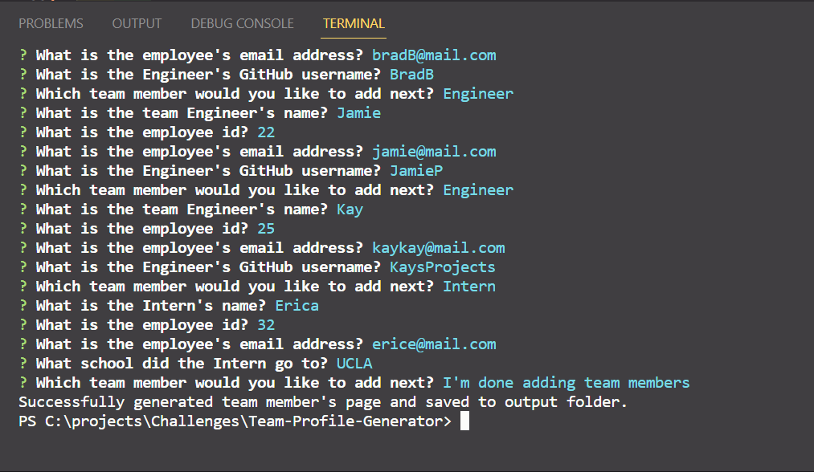

# Team Profile Generator

This Team Profile Generator allows the user to generate a HTML file of their team members by using a command-line application based on the users input. It uses the [Inquirer package](https://www.npmjs.com/package/inquirer) and for testing the [Jest package](https://www.npmjs.com/package/jest). This allows the user to easily and quickly generate a web page with cards displaying their team member's details. 

## Installation

1. Go to this application's repository and click on the "Code" button, then select "Clone repository" and copy the URL provided.
2. Open your terminal or command prompt, navigate to the directory where you want to clone the repository, and run the command ```git clone <URL>``` (where <URL> is the URL you copied in step 1). This will create a new directory containing the cloned repository.
3. After the repository has finished cloning, navigate into the new directory by running the command ```cd <directory-name>``` (where <directory-name> is the name of the directory that was created during cloning).
4. Finally, run the command ```code .``` to open the repository in Visual Studio Code.

## Usage

1. Open the terminal and navigate to the directory/folder titled "Team-Profile-Generator".
2. Run the command ```npm install``` once installed run the command ```node index.js``` in the terminal to start the application.
3. Answer the prompts that are displayed in the terminal about your team members, starting with the manager. There is then the option to add an engineer or intern or select you are finished adding team members. These answers will be used to generate your HTML file.
4. If there are no errors in the process, there will be a message displayed in the terminal to indicate that your HTML file has been successfully created.
5. Finally, you can find your generated HTML file inside the output folder, which is located in the same directory as the index.js file.

### Screenshot of Application's Terminal with Users Input



### Screenshot of the Generated HTML


## Credits 

- [node.js](https://nodejs.dev/en/learn/accept-input-from-the-command-line-in-nodejs/)
